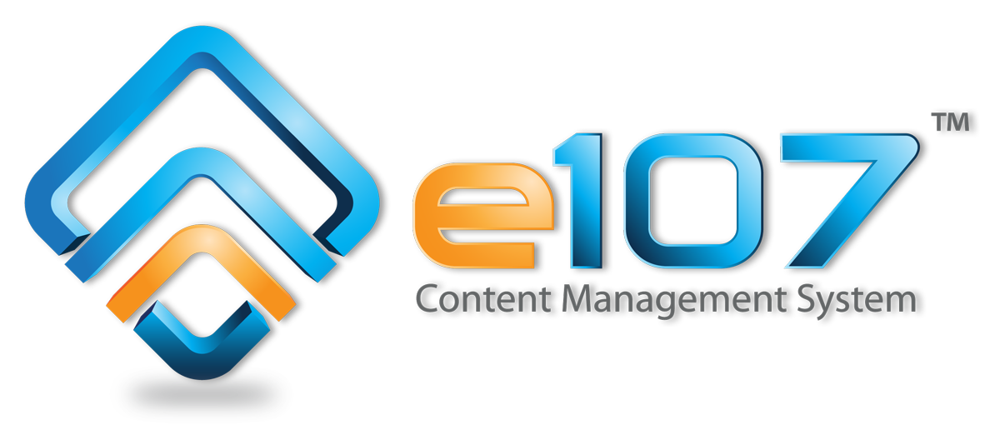

[](https://e107.org)
=================

This is custom version of e107 CMS. Don't use it. It is public to be able syncing via admin dashboard. 

Forum plugin was removed and moved to separately directories.

https://github.com/Jimako-e107-plugins/forum
https://github.com/Jimako-e107-plugins/forum_extended


**[e107][1]** is a free and open-source content management system (CMS) which allows you to manage and publish your content online with ease. Developers can save time in building websites and powerful online applications. Users can avoid programming completely! Blogs, websites, intranets – e107 does it all. 

## Table of Contents

   * [e107 Content Management System](README.md)
      * [Table of Contents](#table-of-contents)
      * [Requirements](#requirements)
         * [Minimum](#minimum)
         * [Recommended](#recommended)
      * [Installation](#installation)
         * [Standard Installation](#standard-installation)
         * [Git Installation (developer version)](#git-installation-developer-version)
      * [Reporting Bugs](#reporting-bugs)
      * [Contributing to Development](#contributing-to-development)
      * [Donations](#donations)
      * [Support](#support)
      * [License](#license)

## Requirements

   ### Minimum

   * A web server (Apache or Microsoft IIS) running PHP 5.6 or newer
   * MySQL 4.x or newer, or MariaDB
   * FTP access to your web server and an FTP client (such as FileZilla)
   * Username and password to your MySQL database

   ### Recommended

   * Apache 2.4 or newer on Linux
   * PHP 7.4 or newer
   * MySQL 5.6 or newer, or MariaDB 10.3 or newer
   * A registered domain name
   * Access to a server control panel (such as cPanel)


## Installation 

### Standard Installation

1. [Download e107](https://e107.org/download).
2. Unzip/Extract the compressed file onto your desired web root.
   This is often a folder called `public_html`. 
3. Point your browser to the `install.php` script (e.g., `https://example.com/subfolder/install.php`)
4. Follow the installation wizard in your browser.


### Git Installation (developer version)

1. Run the following commands, replacing '~' with your document root (the parent of `public_html`) and xxx:xxx is the intended owner of your e107 files.
   ```
   cd ~
   git clone https://github.com/e107inc/e107.git public_html	
   chown -R xxx:xxx public_html 
   ```    
2. Point your browser to the `install.php` script (e.g., `https://example.com/subfolder/install.php`)
3. Follow the installation wizard in your browser.


## Reporting Bugs

Be sure you are using the most recent version of e107 prior to reporting an issue.
You may report any bugs and make feature requests [e107's GitHub Issues page](https://github.com/e107inc/e107/issues).


## Contributing to Development

* Please submit 1 pull request for each GitHub issue you work on. 
* Make sure that only the lines you have changed actually show up in a file-comparison (diff).
  Some text editors alter every line; this should be avoided. 
* It is recommended to configure `git pull` to rebase on the master branch by default to avoid unnecessary merge commits.  You can set this up in your copy of the repo's `.git/config` file like so:
  ```
  [branch "master"]
    rebase = true
  ``` 
* See the [CONTRIBUTING](.github/CONTRIBUTING.md) document for a tutorial on getting started.

## Donations
If you like e107 and wish to help it to improve, please consider making a small donation.

* PayPal: donate (at) e107.org


## Support
* https://e107help.org


## License

e107 is released under the terms and conditions of the GNU General Public License (http://www.gnu.org/licenses/gpl.txt)

  [1]: https://e107.org